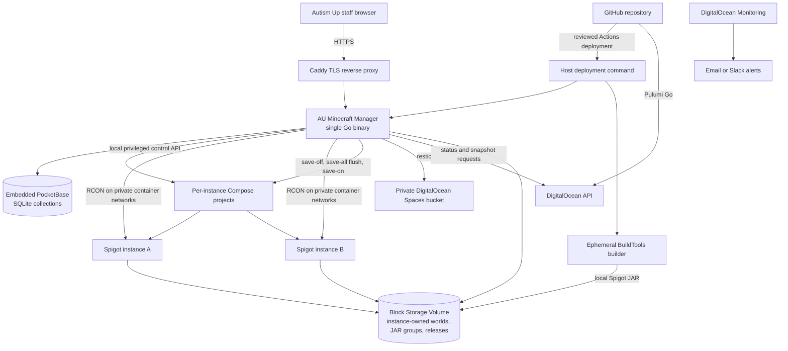

# Autism Up Minecraft Server Manager: Architecture and Delivery Plan

**Status:** Proposed architecture, revision 4
**Date:** September 6, 2026
**Primary runtime:** SpigotMC
**Hosting platform:** DigitalOcean
**Source and deployment control:** GitHub

## Executive decision

Build a Go web application that provides the capabilities of the Minecraft Server Manager (MSM) CLI through a staff-friendly browser interface. Embed PocketBase as the application's persistence, migration, local-account, and authentication framework while keeping all Minecraft orchestration in custom Go services and routes. PocketBase is designed to be used as a Go framework with custom routes and hooks, and its Go migrations can be embedded in the compiled application ([PocketBase framework documentation](https://pocketbase.io/docs/use-as-framework/), [PocketBase Go migrations](https://pocketbase.io/docs/go-migrations/)).

The application will manage one or more named SpigotMC server instances on a single DigitalOcean Droplet, run each instance in a pinned `itzg/minecraft-server` container, keep live worlds and server state on an attached DigitalOcean Block Storage Volume, and back the data up with restic to a private DigitalOcean Spaces bucket. Provision the cloud infrastructure with Pulumi in Go and initiate every infrastructure or application deployment through reviewed GitHub Actions workflows.

The functional baseline is feature parity with MSM, not merely a lifecycle dashboard. MSM supports multiple servers, server creation/deletion/rename, individual and global lifecycle operations, world storage and activation, world and whole-server backups, JAR groups, global defaults with per-server overrides, player administration, console access, command passthrough, and log rotation ([MSM command reference](https://msmhq.com/docs/commands/), [MSM project](https://github.com/msmhq/msm)). The Go manager will translate those capabilities into guided web workflows, role checks, confirmations, and audit records. It will not copy MSM's Bash or `screen` implementation, and it will not add unrelated hosting-platform features such as multi-node scheduling, billing, quotas, or a plugin marketplace.

Spigot's BuildTools model is the most important architectural constraint. Spigot says the server must be compiled with BuildTools rather than downloaded as a prebuilt JAR ([Spigot BuildTools](https://www.spigotmc.org/wiki/buildtools/), [Spigot FAQ](https://www.spigotmc.org/wiki/faq/)). To avoid uncertain redistribution boundaries, GitHub will approve and trigger a deployment, but a temporary builder container on the target Droplet will download the official BuildTools artifact and compile the selected Spigot version locally. The resulting JAR stays on Autism Up's server and is never committed to Git, attached to a public release, or published in a container image.

## Scope and system boundaries

The proposed three-part model is directionally right, but it should be expressed as four layers so that source-controlled definitions are not confused with mutable world data:

| Layer | Responsibility | Source of truth | Deployment or persistence |
|---|---|---|---|
| **Infrastructure** | Droplet, volume, firewall, Reserved IP, Spaces bucket, DNS inputs, monitoring | Pulumi Go in GitHub | GitHub Actions applies reviewed changes to DigitalOcean |
| **Management control plane** | Staff UI, PocketBase local accounts and persistence, application sessions, roles, instance/world/JAR management, lifecycle actions, backups, restores, console, status, and audit log | Go code, embedded PocketBase migrations, and configuration schemas in GitHub | One versioned Go binary installed as a systemd service; PocketBase data remains external on the persistent Volume |
| **Minecraft runtimes** | One or more named instances, each with a pinned Java runtime, container image, locally built Spigot JAR, reviewed plugins, configuration, and resource allocation | Version manifests, Compose templates, configuration, and plugin manifests in GitHub | Manager builds Spigot locally and materializes reviewed releases on the Droplet |
| **World state** | Instance-owned active and inactive worlds, player data, allowlists, logs, and backup metadata | Each instance directory on the live Block Storage Volume plus the encrypted restic repository | Never committed to Git; backed up to Spaces and protected by snapshots |

This separation makes the server rebuildable without treating the worlds as deployment artifacts. The Droplet is disposable; the volume and object backups are durable.

## Target architecture



### DigitalOcean resources

- **Droplet:** Start the one-instance pilot with a 4 GiB RAM, 2 vCPU Basic Droplet and measure actual load before resizing. DigitalOcean currently lists that size at $24 per month, while the next common size is 8 GiB/4 vCPU at $48 per month ([DigitalOcean Droplet pricing](https://www.digitalocean.com/pricing/droplets)). Additional simultaneously running instances require explicit CPU and memory capacity planning; the manager must reject starts that would exceed configured host reservations.
- **Block Storage Volume:** Mount one encrypted volume at `/srv/au-minecraft`. DigitalOcean Volumes can be resized, snapshotted, and moved between Droplets in the same datacenter, and DigitalOcean states that Volumes are encrypted with LUKS ([DigitalOcean Volume features](https://docs.digitalocean.com/products/volumes/details/features/)).
- **Reserved IP:** Attach a Reserved IP to the Droplet so a replacement host can assume the same player-facing address. DigitalOcean Reserved IPs can be reassigned to another Droplet in the same datacenter ([DigitalOcean Reserved IPs](https://docs.digitalocean.com/products/networking/reserved-ips/)).
- **Cloud Firewall:** Default-deny inbound traffic. Permit Minecraft TCP/25565 publicly, HTTPS TCP/443 for the management UI, and SSH only from approved administrator networks. Do not expose RCON TCP/25575 or the Minecraft query port. DigitalOcean Cloud Firewalls are stateful and block traffic that is not expressly allowed ([DigitalOcean Cloud Firewalls](https://docs.digitalocean.com/products/networking/firewalls/)).
- **Spaces:** Use a private, versioned-by-restic object bucket for encrypted world backups. Spaces is S3-compatible, and VPC-local access does not count against outbound transfer ([DigitalOcean Spaces](https://docs.digitalocean.com/products/spaces/)).
- **Monitoring:** Install the DigitalOcean metrics agent and alert on memory, CPU, load, disk utilization, and availability. DigitalOcean Monitoring is an opt-in service and supports email and Slack alert delivery ([DigitalOcean Monitoring](https://docs.digitalocean.com/products/monitoring/), [DigitalOcean alerts](https://docs.digitalocean.com/products/monitoring/how-to/manage-alerts/)).

### Host services

| Service | Packaging | Responsibility |
|---|---|---|
| `au-minecraft-manager` | Static Go binary under systemd with embedded PocketBase | Web implementation of MSM capabilities, local accounts, application sessions, collections, policy, orchestration, jobs, audit history, RCON, backup/restore, and instance catalog |
| Caddy | OS package or pinned container | HTTPS termination and reverse proxy to the manager |
| Docker Engine and Compose | OS packages | Run the Spigot container from a generated, pinned Compose definition |
| `itzg/minecraft-server` | Image pinned by immutable digest | Provide the Java runtime, lifecycle behavior, health check, and standard `/data` layout |
| restic | Pinned binary | Encrypted, deduplicated backups to Spaces |
| DigitalOcean agent | OS package | Host metrics and alerting |

The `itzg/minecraft-server` image supports a custom server JAR by setting `TYPE=CUSTOM` and pointing `CUSTOM_SERVER` to a path inside the container ([custom server documentation](https://docker-minecraft-server.readthedocs.io/en/latest/types-and-platforms/server-types/others/)). This permits the manager to build Spigot locally, place the JAR in a versioned release directory on the attached volume, and mount that release read-only into the runtime container. The image and Java variant must be pinned rather than using `latest`; the project documents release-plus-Java tags such as `<release>-java21` ([image tag documentation](https://docker-minecraft-server.readthedocs.io/en/latest/versions/java/)).

### Volume layout

```text
/srv/au-minecraft/
├── jar-groups/
│   └── spigot/
│       └── 1.21.11/
│           ├── spigot.jar
│           └── build.json
├── releases/
│   └── 2026-09-05.1/
│       ├── plugins/
│       ├── server.properties
│       ├── bukkit.yml
│       ├── spigot.yml
│       └── release.json
├── instances/
│   ├── creative/
│   │   ├── instance.json
│   │   ├── current -> ../../releases/2026-09-05.1
│   │   ├── data/
│   │   │   ├── world/
│   │   │   ├── world_nether/
│   │   │   ├── world_the_end/
│   │   │   ├── plugins/
│   │   │   ├── logs/
│   │   │   ├── whitelist.json
│   │   │   └── ops.json
│   │   └── inactive-worlds/
│   └── survival/
│       ├── instance.json
│       ├── current -> ../../releases/2026-09-05.1
│       ├── data/
│       │   ├── world/
│       │   ├── world_nether/
│       │   ├── world_the_end/
│       │   ├── plugins/
│       │   ├── logs/
│       │   ├── whitelist.json
│       │   └── ops.json
│       └── inactive-worlds/
├── world-templates/
│   └── starter-world/
├── archives/
│   ├── instances/
│   └── worlds/
├── manager/
│   ├── pb_data/
│   │   ├── data.db
│   │   └── auxiliary.db
│   └── audit/
├── staging/
└── restore/
```

Each instance owns all of its mutable server state, including its active worlds, inactive worlds, plugin data, access lists, generated configuration, and logs. The instance's `data` directory is mounted as the container's standard `/data` path, so Spigot world directories such as `world`, `world_nether`, and `world_the_end` remain in their expected locations. Reusable, read-only starter worlds live under `world-templates`; exported or retired instances and worlds live under `archives`. Moving a world to another instance is an explicit export/import operation that copies or moves the data and changes ownership. The system never mounts one writable world into multiple instances.

Immutable releases and shared JAR groups remain outside instance directories so they can be reused and rolled back without duplicating binaries. The instance's `instance.json` and `current` release link identify the exact release required to reconstruct it. A deployment builds into `staging`, runs validation, creates an immutable release directory, and atomically changes an instance's `current` symlink only after approval. Runtime rollback selects the previous release; world rollback remains a separate, explicit restore operation. This ownership decision is recorded in [ADR 0002](../adr/0002-instance-owned-world-storage.md).

## Spigot build and release model

### Why the JAR is built on the server

Spigot documents BuildTools as its supported method for compiling CraftBukkit and Spigot locally, and warns users not to download Spigot JARs found on the internet ([Spigot BuildTools](https://www.spigotmc.org/wiki/buildtools/), [Spigot installation](https://www.spigotmc.org/wiki/spigot-installation/)). Building in GitHub Actions and transferring the JAR through a package registry may work technically, but Spigot does not clearly document permission for private redistribution within one organization. The target-host build is therefore the lower-risk default.

The production host must not build arbitrary unreviewed code. A reviewed release manifest will pin:

```yaml
release: "2026-09-05.1"
minecraft_version: "1.21.11"
buildtools:
  build_number: 196
  sha256: "<verified checksum>"
java:
  major: 21
container:
  image: "itzg/minecraft-server@sha256:<digest>"
plugins:
  - name: "<plugin>"
    version: "<version>"
    source: "<approved source>"
    sha256: "<checksum>"
config_revision: "<git commit>"
```

Spigot publishes per-version metadata with Java compatibility bounds, so the build workflow should verify the selected JDK against the selected Minecraft version instead of relying on a hard-coded assumption ([Spigot version metadata](https://hub.spigotmc.org/versions/1.21.11.json)). BuildTools also requires Git and Java and accepts `--rev <version>` to build a specific release ([Spigot BuildTools](https://www.spigotmc.org/wiki/buildtools/)).

### Release workflow

1. **Change request:** An administrator opens a pull request changing the release manifest, plugin manifest, configuration, manager code, or Pulumi program.
2. **CI checks:** GitHub Actions runs Go formatting, linting, unit tests, race tests, vulnerability scanning, front-end tests, configuration validation, Pulumi preview, secret scanning, and container policy checks.
3. **Review:** A second person reviews and merges the pull request. Production workflow rules allow deployment only from the protected branch.
4. **Host build:** The deployment workflow connects to the Droplet with a restricted deploy identity and invokes `au-minecraft-manager deploy <release>`. The manager verifies the manifest signature or commit identity, downloads the pinned official BuildTools artifact, verifies its checksum, and builds the requested Spigot revision in an ephemeral JDK builder container.
5. **Staging validation:** The manager assembles the release in `/srv/au-minecraft/staging`, validates plugin checksums and configuration, starts an isolated smoke-test container with a disposable world, waits for a healthy status, checks logs for plugin load failures, and shuts it down cleanly.
6. **Safety point:** The manager creates a fresh restic world backup and requests a volume snapshot before a Minecraft version or plugin-set upgrade.
7. **Promotion:** The manager gracefully stops production, promotes the staged release by changing the `current` symlink, starts the pinned runtime container, and verifies health.
8. **Automatic rollback:** If health does not become ready within the configured time or required plugins fail to load, the manager restores the previous release pointer and restarts. It must not automatically roll the world backward because that can discard player progress; a world restore requires an explicit administrator action.
9. **Evidence:** The workflow records the Git commit, actor, manifest, BuildTools version, resulting JAR checksum, plugin checksums, backup ID, snapshot ID, start time, outcome, and rollback outcome.

DigitalOcean's official GitHub action requires a DigitalOcean personal access token; no generally available DigitalOcean GitHub OIDC trust integration is documented ([DigitalOcean `action-doctl`](https://github.com/digitalocean/action-doctl), [DigitalOcean workload-identity proof of concept](https://www.digitalocean.com/blog/oauth-app-workload-identity-droplets)). Store a narrowly scoped token in a protected GitHub Environment, rotate it, and keep infrastructure deployment separate from application deployment. GitHub notes that required reviewers for environments on Free, Pro, and Team plans are limited to public repositories, so a private nonprofit repository may need organization rulesets, protected branches plus CODEOWNERS, or a plan that supports private-environment review controls ([GitHub Environments](https://docs.github.com/en/actions/reference/workflows-and-actions/deployments-and-environments)).

## Management utility

### Product principles

The manager is a web implementation of MSM's administration model. Every MSM capability must have either a first-class web workflow or a documented advanced interface, but the implementation should improve safety instead of reproducing CLI hazards. Normal staff should not need SSH, Docker knowledge, Linux paths, or Minecraft command syntax.

The product must support multiple named server instances even if Autism Up launches with only one. MSM explicitly manages multiple servers and can apply commands to one, several, or all servers ([MSM project](https://github.com/msmhq/msm)). The web design should therefore use an instance selector, instance overview cards, multi-select bulk actions, and an “all active instances” target where the action is safe.

### MSM capability parity

| MSM capability | Web implementation | Role and safety behavior |
|---|---|---|
| `server list` | Instance dashboard showing name, state, address/port, version, players, memory allocation, backup freshness, and active/inactive intent | Viewer |
| `server create <name>` | Guided creation wizard for name, port, JAR group/version, release profile, memory, worlds, and initial settings | Administrator; validates capacity and port conflicts before creation |
| `server delete <name>` | Archive or permanent-delete workflow | Administrator; server must be stopped, current backup required, typed instance-name confirmation, delayed purge |
| `server rename <name> <new-name>` | Rename action in instance settings | Administrator; stopped instance only, validates paths and references |
| `<server> start`, `stop [now]`, `restart [now]`, `status` | Start, graceful stop, immediate stop, graceful restart, immediate restart, and live status controls | Operator for graceful actions; Administrator for immediate actions; warns connected players and shows a countdown by default |
| Global `start`, `stop [now]`, `restart [now]` | Bulk action on selected instances or all active/running instances | Same per-action permissions; per-instance progress and partial-failure reporting |
| `<server> connected` | Connected-player list on each instance | Viewer |
| `<server> worlds list` | World inventory showing owning instance, active/inactive state, disk/RAM mode, size, and last backup | Viewer |
| `<server> worlds load` | Import or clone a world template, archive, or approved upload into the selected instance | Administrator; destination instance owns the resulting copy and must be stopped unless a safe plugin-level load is supported |
| `<server> worlds on\|off <world>` | Move an instance-owned world between its active data area and its `inactive-worlds` area | Administrator; deactivation explains that the world leaves the normal active backup set, matching MSM behavior ([MSM command reference](https://msmhq.com/docs/commands/)) |
| `<server> worlds ram <world>` | Advanced “Run from RAM” toggle | Administrator; disabled by default, capacity checked, prominent volatility warning |
| `<server> worlds todisk` | “Sync RAM worlds to disk” action and recurring safety job | Operator; automatic before stop/restart/backup and periodically while enabled |
| `<server> worlds backup` | World-only backup action, schedule, history, retention, and restore | Operator can run; Administrator configures schedule and restores |
| `<server> backup` | Complete instance backup including configuration, plugins, access lists, and runtime metadata | Operator can run; Administrator restores |
| `<server> jar <jargroup> [<file>]` | Select approved JAR group and version for an instance | Administrator; creates a staged deployment with smoke test and rollback |
| `jargroup list/create/delete/rename/changeurl/getlatest` | JAR/build-group catalog | Administrator; Spigot groups store BuildTools source/version policy rather than an arbitrary public JAR URL |
| `<server> config [<setting> <value>]` | Typed settings editor for Minecraft and manager settings, with raw advanced view | Operator for safe gameplay fields; Administrator for network, memory, path, Java, RCON, and manager fields |
| Global `config` plus per-server overrides | Global defaults page with visible instance overrides and effective-value preview | Administrator |
| `wl on\|off/add/remove/list` | Whitelist page and player search | Operator; disabling the whitelist requires Administrator confirmation |
| `bl player`, `bl ip`, `bl list` | Player and IP ban management | Operator; every change audited |
| `op add/remove/list` | Operator management | Administrator only |
| `gm`, `kick`, `give`, `xp` | Structured player-action forms | Operator according to a configurable action policy; dangerous item/amount limits validated |
| `say`, `time`, `toggledownfall` | Structured server-action forms | Operator |
| `save on/off/all` | Save controls shown under advanced operations | Administrator; `save-off` is time-bounded and automatically reversed after failure or timeout |
| `cmd <command>` | Advanced command entry with output | Administrator by default; optional allowlisted commands may be delegated to Operators |
| `cmdlog <command>` and `console` | Live, read-only log stream plus privileged command input | Viewer can read sanitized logs; Administrator can send commands; no raw host shell |
| `<server> logroll` | Log retention settings plus rotate-now action | Operator can rotate; Administrator configures retention |
| Cron-based backup, RAM-world sync, and log rotation | Built-in schedules for backup, synchronization, log rotation, graceful restart, and approved announcements/commands | Administrator configures schedules; every execution is an audited job |
| `version` and `update` | Manager version/status page and GitHub-controlled upgrade workflow | Viewer sees versions; only a reviewed GitHub deployment updates the manager |

The official MSM command reference documents the command families and parameters above, including player administration, passthrough commands, JAR groups, and global lifecycle actions ([MSM commands](https://msmhq.com/docs/commands/)). MSM also distinguishes active from inactive servers and warns players before a normal stop or restart, using an immediate `now` variant when required ([MSM server commands](https://msmhq.com/docs/commands/server.html)). The web manager should preserve those semantics as desired state, graceful countdown, cancelable operation, and separately permissioned emergency action.

MSM's RAM-world feature should be implemented for parity but remain off by default. Its documentation notes that RAM is volatile, synchronizes RAM worlds to disk automatically on shutdown, and recommends additional periodic synchronization to limit crash loss ([MSM server commands](https://msmhq.com/docs/commands/server.html)). On this architecture, the persistent source remains inside the owning instance directory. The manager uses a per-world tmpfs mount for the runtime copy, synchronizes it back to that instance directory at a configurable interval, forces a disk sync before backup or graceful shutdown, and refuses activation if memory headroom is insufficient.

MSM describes world backups as WorldEdit snapshot compatible and whole-server backups as including configuration, plugins, whitelists, and blacklists ([MSM server commands](https://msmhq.com/docs/commands/server.html)). The manager will preserve both backup scopes but use restic for encrypted, deduplicated off-host storage. Region-level in-game WorldEdit restore compatibility should be validated during Phase 0; if restic snapshots alone do not provide the expected archive layout, the backup job will additionally emit the compatible world archive.

### Web information architecture

- **Fleet:** All instances, aggregate resource reservations, bulk start/stop/restart, host health, and global alerts.
- **Instance:** Overview, connected players, lifecycle controls, release/JAR group, resource allocation, address, and recent activity.
- **Players:** Whitelist, bans, operators, game mode, kick, item/XP actions, and cross-instance targeting.
- **Worlds:** Instance-owned world inventory, active/inactive state, template/import/export actions, RAM/disk mode, backup history, and restore.
- **Backups:** World and complete-instance policies, schedules, snapshots, retention, verification status, and restore jobs.
- **Schedules:** Calendar and interval-based backup, RAM-world synchronization, log rotation, restart, announcement, and approved-command jobs.
- **Console:** Sanitized live logs for authorized users and a role-restricted command input. It is a Minecraft console, never a host shell.
- **Configuration:** Typed `server.properties`, `bukkit.yml`, `spigot.yml`, manager settings, global defaults, per-instance overrides, diff preview, and restart impact.
- **JAR groups:** Spigot BuildTools profiles, built versions, checksums, Java compatibility, assigned instances, and staged update.
- **Administration:** Local users, roles, sessions, password resets, manager version, audit log, storage, and deployment status.

### Roles

| Role | Allowed actions |
|---|---|
| **Viewer** | View fleet and instance status, players, worlds, versions, backup freshness, sanitized logs, and activity |
| **Operator** | Viewer actions plus graceful lifecycle operations, whitelist and bans, approved player/game actions, announcements, backup now, log rotation, and approved configuration changes |
| **Administrator** | Operator actions plus instance creation/archive/delete/rename, immediate stop/restart, restores, JAR groups/releases, operators, arbitrary Minecraft commands, sensitive configuration, local user administration, and deployment initiation |

Permissions should be capability-based internally even if the first UI exposes only these three roles. This avoids hard-coding authorization around page names and permits Autism Up to create a narrower role later without changing every handler.

### Local username and password authentication

The manager will use a PocketBase auth collection as its user directory because Autism Up does not have an identity provider. PocketBase auth collections can use a unique username identity field instead of requiring email for login ([PocketBase authentication](https://pocketbase.io/docs/authentication/)). Accounts contain a unique case-insensitive username, display name, role assignments, status, failed-login counters, credential-change timestamp, and audit metadata. Email remains optional unless Autism Up enables email OTP for MFA.

- **Password storage:** Use PocketBase's password field, which hashes passwords with bcrypt and permits an explicit cost ([PocketBase password field](https://pocketbase.io/jsvm/classes/PasswordField.html)). Pin and benchmark the cost on the production Droplet, with 12 as the initial target and 10 as the minimum accepted work factor. OWASP prefers Argon2id for new designs but recommends bcrypt with a work factor of at least 10 when bcrypt is used ([OWASP Password Storage Cheat Sheet](https://cheatsheetseries.owasp.org/cheatsheets/Password_Storage_Cheat_Sheet.html)). This is an intentional framework trade-off recorded in [ADR 0001](../adr/0001-embed-pocketbase-framework.md).
- **Password policy:** Require at least 15 characters because MFA is not initially present, permit at least 64 characters, allow Unicode and spaces, do not silently truncate, and do not impose composition rules. Do not require periodic changes; require a change after suspected compromise or administrator reset. These choices follow OWASP's authentication guidance for password-only systems ([OWASP Authentication Cheat Sheet](https://cheatsheetseries.owasp.org/cheatsheets/Authentication_Cheat_Sheet.html)).
- **Login defense:** Apply custom Go middleware and PocketBase hooks for per-account and per-source-IP rate limits, exponential delays, generic failure messages, security-event logging, and temporary lockouts that do not permanently enable denial of service. Never log passwords, password-reset tokens, PocketBase tokens, or application session identifiers.
- **Sessions:** Do not use a PocketBase auth token as the browser session. PocketBase documents that its tokens are stateless, are not stored in the database, and do not have a traditional logout endpoint that invalidates an issued token ([PocketBase authentication](https://pocketbase.io/docs/authentication/)). After PocketBase verifies credentials, issue an opaque, cryptographically random application session stored in the `app_sessions` collection. Send only its identifier in a `Secure`, `HttpOnly`, `SameSite=Strict` cookie; rotate it after login, password change, or role change; enforce idle and absolute expiry; and invalidate all sessions after password reset or account disablement. OWASP recommends cookie-based session exchange over HTTPS and regeneration after privilege changes ([OWASP Session Management Cheat Sheet](https://cheatsheetseries.owasp.org/cheatsheets/Session_Management_Cheat_Sheet.html)).
- **CSRF and reauthentication:** Protect every state-changing request with CSRF controls. Require the current password again for password changes, restores, permanent deletion, user/role administration, and emergency console use.
- **Bootstrap:** On first installation, create no default password. A custom root-only PocketBase CLI command generates a single-use, short-lived setup token that opens the first-administrator creation page. The token becomes invalid immediately after use.
- **Recovery:** An Administrator can issue another user a single-use, short-lived reset token and force a password change at next login. If every administrator is locked out, a custom root-only CLI recovery command on the Droplet creates a time-limited recovery token. There are no security questions and no email-only recovery dependency.
- **Optional MFA:** PocketBase MFA requires two different enabled authentication methods and documents password plus emailed OTP as an example ([PocketBase authentication](https://pocketbase.io/docs/authentication/)). If reliable SMTP is configured, email OTP can be offered to Administrators in the first release. Authenticator-app TOTP is not assumed to be supplied by PocketBase and remains a separate future feature.

### PocketBase framework boundary

PocketBase is embedded in the manager process as a Go library, not deployed as a separate service. It provides the data access layer, SQLite storage, auth-record verification, event hooks, custom routes, custom CLI commands, and schema migrations. PocketBase is a regular Go package and its pure-Go SQLite implementation can be compiled into a portable executable; its Go migrations can be embedded and applied when the application starts ([PocketBase Go overview](https://pocketbase.io/docs/go-overview/), [PocketBase Go migrations](https://pocketbase.io/docs/go-migrations/)).

| PocketBase owns | Custom manager code owns |
|---|---|
| Auth records and bcrypt password verification | Capability authorization and role policy |
| Collection schema and record persistence | Opaque application session issuance, rotation, and revocation |
| Embedded Go migrations | Minecraft lifecycle, RCON, Docker/Compose, BuildTools, backup, restore, and synchronization workflows |
| Record and request hooks | Persisted job orchestration, idempotency, timeouts, reconciliation, and per-instance locks |
| Internal maintenance APIs and CLI extension points | Staff UI, guided workflows, destructive-action confirmation, and append-only audit policy |

Initial collections are `users` (auth), `roles`, `role_capabilities`, `app_sessions`, `instances`, `worlds`, `jar_groups`, `releases`, `schedules`, `jobs`, `audit_events`, and `settings`. Every `worlds` record has one owning instance and a relative path constrained beneath that instance directory. Operational collections deny direct client mutation through generic record APIs; staff operations use custom, capability-checked Go routes that enforce state transitions and write audit events. Collection rules provide defense in depth, not the primary authorization model.

PocketBase superusers bypass collection rules and can access or modify all data ([PocketBase authentication](https://pocketbase.io/docs/authentication/)). The PocketBase superuser dashboard is therefore not a staff administration interface. Production must disable it if the embedded version supports doing so, or restrict it to localhost and documented break-glass maintenance. Staff account administration is implemented in the manager UI through custom routes.

### Implementation boundaries

- **Use:** PocketBase embedded as a Go framework and SQLite-backed collection layer, `//go:embed` for the staff UI, custom PocketBase routes and hooks for workflows and policy, `gorcon/rcon` for private RCON, restic as a subprocess with a restricted environment, and the DigitalOcean Go client only for narrowly defined snapshot/status operations.
- **Avoid:** Kubernetes, a message broker, a separate database server, a plugin marketplace, arbitrary host shell execution, multi-node scheduling, billing, and quotas.
- **Privilege separation:** Run the manager as an unprivileged user. Grant access only to a narrow root-owned helper or tightly constrained systemd/Docker operations. Do not give the web process unrestricted root or Docker socket access if a minimal helper can provide the required verbs.
- **Job model:** Lifecycle, backup, restore, world synchronization, build, deploy, archive, and bulk operations are persisted jobs with per-instance locks, timeouts, cancellation rules, and idempotency keys. Independent instances may run jobs concurrently within host resource limits. A manager restart must reconcile every unfinished operation and must not leave a server in `save-off` mode or a RAM world unsynchronized.
- **Console boundary:** The advanced console sends commands only through RCON to a selected Minecraft instance. It never passes input to a shell, Docker command line, BuildTools process, or host service.

## Security baseline

### Minecraft controls

- Keep `online-mode=true` so clients are verified, set `white-list=true`, and set `enforce-whitelist=true` ([Minecraft `server.properties`](https://minecraft.wiki/w/Server.properties)).
- Bind RCON only to localhost or a private container network. RCON is unencrypted and should not be exposed to the internet ([Minecraft RCON](https://minecraft.wiki/w/RCON)).
- Leave the query protocol disabled unless a documented use case appears. Its default setting is disabled ([Minecraft `server.properties`](https://minecraft.wiki/w/Server.properties)).
- Accept the Minecraft EULA explicitly and record the acceptance decision in the deployment configuration. The container requires `EULA=TRUE` to confirm acceptance ([itzg image documentation](https://docker-minecraft-server.readthedocs.io/en/latest/)).
- Pin Minecraft, Spigot, Java, plugins, the container image digest, the manager binary, and restic. No production component should auto-update.
- Permit plugins only through pull requests with source URL, version, checksum, license review, and a staging smoke test. Spigot notes that most Bukkit plugins work but plugins using internal CraftBukkit or Minecraft code may not ([Spigot installation](https://www.spigotmc.org/wiki/spigot-installation/)).

### Management controls

- Serve only HTTPS; redirect HTTP to HTTPS.
- Authenticate staff against the PocketBase auth collection using locally managed usernames and bcrypt password hashes with an explicit cost, then authorize every custom endpoint by application capability.
- Rate-limit login and recovery attempts by account and source, return generic authentication errors, and alert administrators on suspicious failure patterns.
- Store only opaque application session identifiers in secure cookies, never PocketBase bearer tokens; rotate sessions after authentication or privilege changes, and invalidate all sessions when an account is disabled or its password is reset.
- Require a fresh authentication check for restores, deployments, role changes, and emergency console access.
- Deny direct client mutation of operational collections, keep the PocketBase superuser dashboard off the public listener, and reserve superuser credentials for root-only break-glass maintenance.
- Keep secrets out of Git. Store infrastructure credentials in GitHub Environments, host runtime secrets in root-readable files or systemd credentials, and store backup credentials separately from world data.
- Do not expose the Docker socket directly to the browser-facing process. Use a narrow local control interface with an allowlist of operations.
- Record actor, action, target, before/after values where practical, outcome, source IP, release, and timestamp for each mutation.

## Backup, restore, and disaster recovery

### Consistent world backup

A backup is successful only after the selected instance has flushed its world state and the repository has been verified. Each instance is quiesced independently so a backup of one server does not pause every server. The sequence is:

1. Send `save-off` over local RCON.
2. Send `save-all flush` and wait for confirmation.
3. Run restic against the data paths.
4. Always send `save-on` in a deferred/finally path, including after timeout or backup failure.
5. Run a lightweight restic repository check and record the snapshot ID.

Minecraft documents that `save-off` stops writing level files while changes are queued, `save-all flush` writes players and chunks immediately, and `save-on` re-enables saving ([Minecraft save commands](https://minecraft.wiki/w/Commands/save-all)). This sequence enables a consistent online backup without routinely stopping the server.

### Retention proposal

- Every 6 hours: world and player data.
- Daily: complete backup of each active instance directory, including active and inactive worlds, whitelist, operators, generated configuration, plugin data, logs required for recovery, and `instance.json`.
- Before deleting an instance or deactivating a world: named safety backup with a delayed purge policy.
- Before every release: named safety snapshot retained for at least 30 days.
- Restic retention: 14 daily, 8 weekly, and 12 monthly snapshots.
- DigitalOcean Volume snapshot: before Minecraft, Spigot, Java, or plugin upgrades.
- DigitalOcean Droplet backup: weekly as a machine-level convenience, not as the primary world backup.

Restic supports encrypted, deduplicated backups to S3-compatible storage ([restic](https://github.com/restic/restic)). DigitalOcean offers both Volume snapshots and Droplet backups, but snapshots preserve disk contents rather than all Droplet metadata or its IP address ([DigitalOcean snapshots](https://docs.digitalocean.com/products/snapshots/how-to/create-and-restore-droplets/)). The Pulumi program and Reserved IP therefore remain essential to recovery.

The supported manual export is also instance-scoped: after the manager stops or quiesces the server, it can archive the complete `instances/<name>` directory with its release manifest and checksums. Operators must not zip a live instance directory directly because Minecraft may be changing chunks and player data during the copy.

PocketBase metadata is backed up through its built-in backup API, which creates a full snapshot of `pb_data` and can store backups locally or in S3-compatible storage ([PocketBase production guidance](https://pocketbase.io/docs/going-to-production/)). The manager will create that archive before the daily restic run so account, session, instance, job, and audit metadata are recoverable consistently with the server data. It will not copy a live `data.db` file directly.

### Recovery objectives

Initial targets, to validate in testing:

- **World recovery point objective:** 6 hours.
- **World recovery time objective:** 60 minutes.
- **Complete host recovery time objective:** 2 hours.

Run a quarterly restore exercise into an isolated path and temporary container. A backup is not considered proven until a test server starts from it, the expected world loads, and a checklist records the result.

### Recovery paths

- **Bad configuration or plugin:** Roll back to the prior immutable release; keep current world data.
- **World corruption or accidental damage:** Stop the owning instance, make a final forensic backup, restore the selected restic snapshot into `/restore`, validate it in an isolated container, then atomically replace the affected world directories beneath that instance.
- **Failed Droplet:** Provision a new Droplet from Pulumi, attach the existing volume, install the manager release, reassign the Reserved IP, and validate.
- **Lost volume:** Recreate the volume, restore the latest restic snapshot from Spaces, deploy the last known-good release, and reassign the Reserved IP.
- **Regional incident:** Create infrastructure in the documented recovery region, restore from an off-region or off-provider backup copy, update DNS or the advertised endpoint, and validate. Adding a second backup destination is a phase-two resilience improvement.

## Open-source tool assessment

### Management panels

| Project | What it does well | Spigot path | Why it is not primary |
|---|---|---|---|
| **Crafty Controller 4** | Minecraft-specific UI, granular role permissions, scheduler, backup manager, OpenAPI API ([Crafty roles](https://docs.craftycontrol.com/pages/user-guide/user-role-config/), [Crafty scheduler](https://docs.craftycontrol.com/pages/user-guide/task-scheduler/), [Crafty backups](https://docs.craftycontrol.com/pages/user-guide/backup-manager/)) | Import a server archive containing a separately built JAR ([Crafty server import](https://docs.craftycontrol.com/pages/user-guide/server-creation/minecraft/)) | Best fallback, but Python-based rather than a Go binary; backup documentation is inconsistent between installation and user-guide pages |
| **Pterodactyl** | Mature container isolation, APIs, local or S3 backups ([Pterodactyl configuration](https://pterodactyl.io/panel/1.0/additional_configuration.html)) | Official egg runs BuildTools on the game host ([Pterodactyl Spigot egg](https://eggs.pterodactyl.io/egg/games-spigot/)) | PHP panel, database, web server, and Wings are excessive for this single-host nonprofit environment; its install-time production build bypasses the desired reviewed release process |
| **Pelican** | Active Pterodactyl fork, APIs, SQLite option, official Spigot egg ([Pelican documentation](https://pelican.dev/docs/), [Pelican eggs](https://github.com/pelican-eggs/minecraft)) | Spigot egg based on the same host-build model | Still a PHP panel plus Wings, and the researched release was pre-1.0 beta; AGPL obligations require care if modified and publicly served ([Pelican FAQ](https://pelican.dev/faq/)) |
| **MCSManager** | Relatively light Node.js install, web UI, daemon architecture, HTTP API, RCON support ([MCSManager](https://mcsmanager.com/), [MCSManager releases](https://github.com/MCSManager/MCSManager/releases)) | Upload and run a BuildTools-produced server core JAR ([MCSManager Java setup](https://docs.mcsmanager.com/setup_java_edition.html)) | Permission and scheduled-backup guarantees are less clearly documented; not Go |
| **LinuxGSM** | Simple lifecycle, monitoring, backup, and cron-oriented CLI ([LinuxGSM Minecraft](https://linuxgsm.com/servers/mcserver/)) | Requires manual custom JAR installation | No web UI, API, or documented RBAC; unsuitable for non-technical staff |

Every panel above is genuinely open source under GPL, MIT, AGPL, Apache-2.0, or MIT respectively ([Crafty license](https://gitlab.com/crafty-controller/crafty-4/-/blob/master/LICENSE), [Pterodactyl](https://github.com/pterodactyl/panel), [Pelican](https://github.com/pelican-dev/panel), [MCSManager](https://github.com/MCSManager/MCSManager/blob/master/README.md), [LinuxGSM](https://github.com/GameServerManagers/LinuxGSM)). None provides a Go single-binary management layer.

### Packaging choices

| Option | Assessment |
|---|---|
| **Pinned `itzg/minecraft-server` container plus Compose** | Recommended. It provides a standard data mount, container health check, memory controls, Java-specific image tags, and custom-JAR support ([health check](https://docker-minecraft-server.readthedocs.io/en/latest/misc/healthcheck/), [data directory](https://docker-minecraft-server.readthedocs.io/en/latest/data-directory/), [custom JAR](https://docker-minecraft-server.readthedocs.io/en/latest/types-and-platforms/server-types/others/)). Pin by digest and disable implicit updates. |
| **Podman plus Quadlet** | Technically strong and daemonless, with systemd integration and health settings ([Podman Quadlet](https://docs.podman.io/en/latest/markdown/podman-systemd.unit.5.html)). It adds a less familiar operating model without a clear benefit for this small deployment. |
| **Native Java under systemd** | Lowest component count, and Spigot documents direct `java -jar spigot.jar nogui` execution ([Spigot installation](https://www.spigotmc.org/wiki/spigot-installation/)). It shifts Java installation, process health, and filesystem assembly into custom automation that the container already handles. |
| **Spigot mode with runtime download** | Not recommended. The image documentation says the default automated Spigot download provider no longer works reliably and recommends alternatives ([itzg Bukkit/Spigot documentation](https://docker-minecraft-server.readthedocs.io/en/latest/types-and-platforms/server-types/bukkit-spigot/)). Use the locally built JAR as a custom server instead. |

### Reusable Go ecosystem components

- **PocketBase:** Embeddable Go backend framework providing SQLite persistence, authentication, CRUD primitives, hooks, routing, and migrations while preserving a single compiled manager binary ([PocketBase documentation](https://pocketbase.io/docs/), [PocketBase Go overview](https://pocketbase.io/docs/go-overview/)).
- **Caddy:** Go-based web server with automatic HTTPS, suitable as the manager's TLS front door ([Caddy](https://github.com/caddyserver/caddy)).
- **restic:** Go-based encrypted and deduplicated backup tool with S3 support ([restic](https://github.com/restic/restic)).
- **gorcon/rcon:** Go RCON implementation tested with Minecraft, suitable for local lifecycle and save commands ([gorcon/rcon](https://github.com/gorcon/rcon)).
- **Go `embed`:** Standard-library support for compiling web assets into the manager binary ([Go `embed`](https://pkg.go.dev/embed)).
- **godo:** DigitalOcean's Go client library, suitable for narrowly scoped snapshot and status calls ([godo](https://github.com/digitalocean/godo)).
- **Pulumi DigitalOcean:** A Go SDK is available for defining DigitalOcean infrastructure ([Pulumi DigitalOcean provider](https://www.pulumi.com/registry/packages/digitalocean/)).

## Repository design

```text
/
├── cmd/
│   └── au-minecraft-manager/
├── internal/
│   ├── auth/
│   ├── backup/
│   ├── console/
│   ├── deploy/
│   ├── instances/
│   ├── jargroups/
│   ├── jobs/
│   ├── minecraft/
│   ├── pocketbase/
│   ├── players/
│   ├── worlds/
│   └── audit/
├── migrations/
├── web/
│   ├── templates/
│   └── static/
├── infra/
│   ├── Pulumi.yaml
│   ├── Pulumi.production.yaml.example
│   └── main.go
├── deploy/
│   ├── compose.yaml.tmpl
│   ├── au-minecraft-manager.service
│   ├── caddy/
│   └── cloud-init.yaml
├── config/
│   ├── server.properties
│   ├── bukkit.yml
│   ├── spigot.yml
│   ├── plugins.yaml
│   └── release.yaml
├── docs/
│   ├── architecture/
│   ├── operations/
│   └── adr/
├── .github/
│   ├── workflows/
│   │   ├── ci.yaml
│   │   ├── infra-preview.yaml
│   │   ├── infra-apply.yaml
│   │   ├── release.yaml
│   │   ├── deploy.yaml
│   │   └── backup-restore-test.yaml
│   ├── CODEOWNERS
│   └── dependabot.yaml
├── go.mod
├── go.sum
├── Makefile
├── LICENSE
└── README.md
```

Use Pulumi Go for infrastructure because the project explicitly prefers Go. Terraform remains a sound fallback with a mature DigitalOcean provider and remote state in Spaces ([DigitalOcean Terraform documentation](https://docs.digitalocean.com/reference/terraform/)), but choosing it would introduce HCL as a second implementation language. Pulumi state should be stored in a protected backend and never on the Droplet.

## Delivery plan

### Phase 0: Decisions and proof of concept

**Goal:** Retire the highest-risk runtime, authentication, and MSM-parity assumptions before building the full UI.

- Confirm the Minecraft version, expected concurrent players, number of named instances, initial plugins, domain name, and region.
- Convert the official MSM command reference into executable acceptance tests and identify which actions require Viewer, Operator, or Administrator permission.
- Prototype embedded PocketBase startup and migration, username authentication, the explicit bcrypt cost, application-session rotation and revocation, rate limiting, administrator-issued reset, root-only recovery, collection-rule denial, and production dashboard restriction.
- Build the selected Spigot version with official BuildTools in an ephemeral container on a disposable Droplet.
- Prove the locally built JAR runs through `itzg/minecraft-server` using `TYPE=CUSTOM`.
- Verify RCON is reachable only from the manager network and that `save-off`, `save-all flush`, and `save-on` behave as expected.
- Back up a generated test world to Spaces with restic, destroy it, restore it, and launch it successfully.
- Validate WorldEdit snapshot compatibility and the tmpfs-to-disk synchronization design for MSM's RAM-world capability.
- Record an architecture decision for the Spigot build location after legal/organizational review.

**Exit criteria:** Scripted tests prove local login/recovery, Spigot build, launch, save quiescence, backup, restore, RAM-world synchronization, and health checks; the MSM parity matrix is an approved product baseline.

### Phase 1: Infrastructure foundation

**Goal:** Create a rebuildable, secure DigitalOcean baseline.

- Implement Pulumi stacks for network/firewall, Droplet, Volume, Reserved IP, Spaces, DNS inputs, monitoring, and alert policies.
- Keep cloud-init minimal: create service accounts, mount the volume, install pinned prerequisites, and install the manager bootstrap.
- Add GitHub CI, protected branch rules, CODEOWNERS, infrastructure preview, and manually approved apply.
- Document credential creation, scope, rotation, and emergency revocation.

**Exit criteria:** A new environment can be created from an empty DigitalOcean project by a reviewed GitHub workflow, and `pulumi preview` is clean after deployment.

### Phase 2: Runtime and deployment controller

**Goal:** Make multiple Spigot instances and their releases deterministic and reversible.

- Implement the release manifest schema, checksum validation, BuildTools builder, plugin assembly, immutable releases, smoke-test container, atomic promotion, and release rollback.
- Implement the instance catalog, server create/archive/delete/rename, active/inactive desired state, port and memory allocation, JAR groups, global defaults, and per-instance overrides.
- Generate one Compose project per active instance from its effective manifest and pin the runtime image by digest.
- Implement structured logs, persisted deployment/job state, instance-owned world inventory and import/export operations, and per-instance locking.
- Add automated tests for resource conflicts, failed download, bad checksum, build failure, plugin load failure, health timeout, interrupted promotion, and partial bulk-operation failure.

**Exit criteria:** The system can create and operate at least two isolated test instances, share an approved JAR group, preserve separate worlds, and return either instance to its prior runtime release on failed health without changing world state.

### Phase 3: Staff management experience

**Goal:** Deliver the complete MSM capability set through safe web workflows.

- Implement PocketBase-backed username/password login, bootstrap and recovery commands, Viewer/Operator/Administrator capabilities, custom application-session management, password changes, account administration, login protections, and optional email OTP MFA when SMTP is available.
- Implement fleet and instance dashboards, individual and bulk lifecycle controls, player administration, world activation and RAM/disk mode, world and whole-instance backups, JAR groups, global/per-instance configuration, logs, console commands, log rotation, job progress, and audit history.
- Add safeguards for connected players, immediate actions, destructive operations, RAM-world volatility, concurrent jobs, host-capacity oversubscription, stale status, and partial failure.
- Conduct usability testing with at least two non-technical staff members and revise labels, confirmations, and recovery messages.

**Exit criteria:** Automated acceptance tests map every supported MSM command to a web/API action, and staff can perform routine operations from the web UI without shell access.

### Phase 4: Restore and operational readiness

**Goal:** Prove that failures are recoverable.

- Implement administrator-only restore with validation in an isolated container.
- Automate retention, repository checks, pre-upgrade snapshots, backup-freshness alerts, and disk-capacity alerts.
- Write runbooks for bad plugin, bad release, corrupted world, failed Droplet, lost volume, lost credentials, locked administrator accounts, and compromised passwords.
- Run a game-day recovery exercise and measure actual recovery objectives.

**Exit criteria:** A second person follows the runbooks to restore a world and rebuild the Droplet within the agreed objectives.

### Phase 5: Production launch and stabilization

**Goal:** Launch conservatively and tune from evidence.

- Import or create the production world, establish operators and whitelist, take a baseline backup, and run a limited pilot.
- Monitor tick health, CPU, memory, disk growth, backup duration, and staff support issues.
- Adjust Droplet size, heap, view distance, backup frequency, and UI wording only through reviewed changes.
- Conduct a 30-day review and decide whether any deferred panel-like features are truly needed.

**Exit criteria:** Thirty days of operation with successful backups, no unmanaged changes, and no routine staff dependency on SSH.

## Testing and quality gates

### Go manager

- Unit tests for PocketBase auth configuration, password-cost upgrades, application-session rotation and revocation, rate limits, capability authorization, state transitions, manifest parsing, RCON response handling, retention selection, and audit records.
- Integration tests with multiple disposable Minecraft containers, a fake DigitalOcean API, temporary restic repository, RAM-world synchronization, and interrupted job recovery.
- Migration and security tests that start from every supported prior schema, deny direct operational collection mutation, prove the PocketBase dashboard is not publicly reachable, and verify that PocketBase bearer tokens are never accepted as manager sessions.
- `go test -race ./...`, static analysis, dependency vulnerability scanning, linting, and reproducible release builds.
- Browser tests for bootstrap, login, password/reset flows, permissions, instance creation, lifecycle and bulk confirmations, world actions, player administration, console restrictions, failed backups, and restore safeguards.
- Contract tests generated from the MSM capability matrix, with a documented disposition for every command in the official reference.

### Infrastructure

- Pulumi unit tests for firewall rules, encryption/persistence flags, volume attachment, Reserved IP, monitoring, and tags.
- Preview on every pull request; apply only from the protected default branch.
- Policy checks that fail if RCON is public, SSH is open globally, the world path is on ephemeral disk, or a mutable container tag is used.

### Deployment

- Verify all downloaded artifacts by checksum.
- Build Spigot in a clean workspace.
- Launch a disposable smoke-test world and assert healthy startup plus required plugin load.
- Back up before promotion and retain the prior release.
- Exercise rollback automatically in CI against a non-production environment.

## Operational model

| Cadence | Operator | Administrator / engineering |
|---|---|---|
| Daily | Check dashboard only if alerted; manage whitelist; use backup-now before special events | Review failed jobs or alerts |
| Weekly | Confirm server and latest backup show healthy | Review capacity trend, failed logins, audit events, and restic status |
| Monthly | No routine technical work | Patch manager dependencies through PR, rotate/verify backups, review plugin updates |
| Quarterly | Participate in a short service drill if appropriate | Restore test, access review, credential review, capacity review, runbook update |
| Before upgrade | Communicate maintenance window | PR, staging validation, backup, Volume snapshot, reviewed promotion |

The UI should make normal success quiet and abnormal states obvious. Staff should receive one actionable message such as “Backup has not completed for 8 hours; the server is still running” rather than raw Java, Docker, or restic output.

## Risks and mitigations

| Risk | Consequence | Mitigation |
|---|---|---|
| **Spigot distribution ambiguity** | Inappropriate artifact storage or distribution | Build on the target host with official BuildTools; retain only locally; obtain legal guidance before moving builds to CI |
| **MSM parity expands product scope** | Longer delivery and larger security surface | Treat the official command set as a closed parity baseline, implement by capability slices, and reject unrelated hosting-platform features |
| **Docker control privilege** | Web compromise becomes host compromise | Narrow privileged helper, allowlisted actions, no arbitrary host shell, strong local authentication, reauthentication, and audit log |
| **Password database compromise** | Offline password guessing and account takeover | Explicit and benchmarked PocketBase bcrypt cost, strong password length, encrypted off-host backups, cost upgrades, rate limits, and optional email OTP MFA |
| **PocketBase stateless token remains valid** | Password reset or logout does not revoke a stolen framework token | Never expose or accept PocketBase bearer tokens as browser sessions; issue revocable opaque application sessions and revoke them after security-sensitive changes |
| **PocketBase superuser exposure** | An attacker bypasses all collection rules and modifies manager state | Keep the dashboard off the public listener, restrict maintenance to localhost/root access, deny staff superuser credentials, and test the production route surface |
| **PocketBase upgrade or migration failure** | Manager startup fails or schema/data are corrupted | Pin the PocketBase version, embed reviewed migrations, back up `pb_data` before upgrades, test every migration path, and keep rollback artifacts |
| **Administrator lockout** | Staff cannot manage the service | Root-only local recovery command, single-use short-lived token, documented and tested recovery procedure |
| **Console command abuse** | Minecraft data or access can be changed outside guided controls | Administrator-only arbitrary commands, Operator allowlist, no shell passthrough, audit every command, and reauthenticate for emergency console |
| **RAM-world crash** | Recent world progress can be lost | Disabled by default, capacity checks, frequent disk sync, mandatory sync before backup/stop, clear warning, and persistent source copy |
| **Plugin incompatibility** | Startup failure or world corruption | Pinned plugins, checksums, disposable smoke test, pre-upgrade backup and snapshot |
| **World growth exhausts disk** | Server outage or failed backups | Separate resizable Volume, disk alerts, capacity dashboard, retention policy |
| **Backup exists but cannot restore** | Permanent data loss | Quarterly isolated restore test and recorded evidence |
| **DigitalOcean long-lived token** | Cloud account compromise | Minimum scope, protected environment, rotation, separate tokens, audit, rapid revocation procedure |
| **Private-repo review limitations on GitHub plan** | Deployment may not receive an independent approval gate | Protected branches, CODEOWNERS, organization rulesets, or a GitHub plan supporting required private-environment reviews |
| **Single Droplet failure** | Temporary outage | Rebuildable Pulumi stack, attached Volume, Reserved IP, restic backup, tested two-hour recovery objective |
| **SMTP outage when email OTP is enabled** | MFA users cannot complete login | Keep SMTP optional, monitor delivery, provide documented root-only recovery, and do not make email the only password-recovery path |

## Fallback architecture

If the custom UI proves too costly to maintain, deploy Crafty Controller 4 as the management interface while retaining the same DigitalOcean foundation, GitHub release manifest, target-host Spigot build, external restic backups, and release controls. Crafty is the best panel fallback because it is Minecraft-specific and documents granular role permissions, scheduled tasks, backups, and server import ([Crafty roles](https://docs.craftycontrol.com/pages/user-guide/user-role-config/), [Crafty scheduler](https://docs.craftycontrol.com/pages/user-guide/task-scheduler/), [Crafty server import](https://docs.craftycontrol.com/pages/user-guide/server-creation/minecraft/)).

Before adopting Crafty, test its backup behavior in the exact container/install mode because its Docker installation page and backup-manager guide make conflicting claims about built-in backup/restore. Continue using the manager-independent restic workflow regardless. Accept explicitly that this fallback introduces Python and no longer satisfies the Go single-binary preference for the management layer.

## Decisions needed before implementation

1. **Minecraft target:** Exact Minecraft/Spigot version and the policy for how quickly new versions are adopted.
2. **Capacity:** Expected peak concurrent players, planned view distance, and known heavy plugins.
3. **Instance model:** Expected number of configured instances, maximum concurrently running instances, per-instance ports, and which global actions staff need.
4. **Plugins:** Initial list, source URLs, licenses, configuration owners, and whether any plugin needs a database.
5. **Accounts:** Initial local Administrators and Operators, password-reset authority, session lifetimes, whether SMTP is available, and whether optional PocketBase email OTP MFA belongs in the first release.
6. **Access:** Whether the password-protected management UI is internet-reachable or additionally restricted by network/VPN or source IP.
7. **GitHub plan:** Repository visibility and availability of required reviewers or organization rulesets.
8. **Recovery:** Acceptable data-loss window and downtime, plus whether an off-provider backup copy is required at launch.
9. **Domain:** Player hostname and management hostname.
10. **Legal review:** Confirmation that target-host BuildTools compilation is the preferred organizational interpretation of Spigot and Minecraft distribution terms.

## Recommended next action

Approve Phase 0 as a short technical spike. The first repository work should be the MSM parity acceptance-test catalog, an embedded PocketBase foundation with username authentication and revocable application sessions, a minimal Pulumi DigitalOcean stack, a host-side BuildTools builder, a pinned custom-JAR Compose definition, and automated backup, restore, and RAM-world synchronization tests. Do not build the full interface until those foundations are proven.
